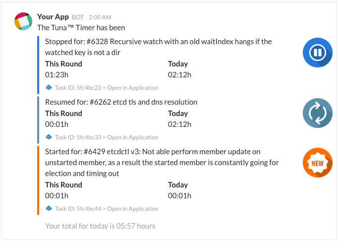

# Slack Time     

[](https://semaphoreci.com/pavlikus/slack-time)
[](https://codecov.io/gh/tuna-timer/tuna-timer-api)
[](https://codeclimate.com/github/tuna-timer/tuna-timer-api)

"Slack Time" a simple time tracker for teams that use [Slack](https:www.slack.com) as their office. Using the tool you and your team members can track time spent on tasks as well as get exhaustive reports.

It leverages a custom [slash command](https://api.slack.com/slash-commands) for Slack. It helps team members to track times they spend on tasks.

## Features

* Start and stop timer on a task
* Resume the timer on the last stopped task
* See what tasks you and other team member are working on currently
* Flexible reporting:
    * Get aggregated report for given team member for given time frame (this week, last week, this month, last month etc) as a message in a Slack channel
    * Generate a CSV or XLSS report file and post its link to Slack so you can click to download the report


## Look and feel



## Quick tour

#### Start a timer on task

Suppose you post a message like below in **_#my-project_** Slack channel:

```
/timer start create HDPI variant of the logotype
```

This will create a new task called "Create HDPI variant of the logotype" in **_my-project_** project and start timer on it.

#### What of my tasks has the timer on?

Then later you would like to see what task your timer in on currently:

```
/timer status
```

will reply you with this (_todo: put a actual image from Slack channel_)

```
Project: my-project     Task: Create HDPI variant of the logotype       Task ID: e4f96c7
User: pavlo             Status: in progress                             Time Spent: 25 minutes
```

#### Stop timer on task

Then later you finsh the task by either starting a new one - "Slack Time" will automatically stop the other one if any - or explicitly stop it like this:

```
/timer stop
```

which would reply like this:

```
Project: my-project     Task: Create HDPI variant of the logotype       Task ID: e4f96c7
User: pavlo             Status: completed                               Time Spent: 1:20h
```


  
## Assumptions and defaults

A team member can only do **ONE** task at a time. If you start a new one that would stop the one you had a timer on previously. 

# Basic syntax

# How to run the app on your server

It is recommended to use Docker images to run the application. 

* `DATABASE_USER`
* `DATABASE_PASS`
* `DATABASE_HOST`
* `DATABASE_PORT`
* `DATABASE_NAME`

